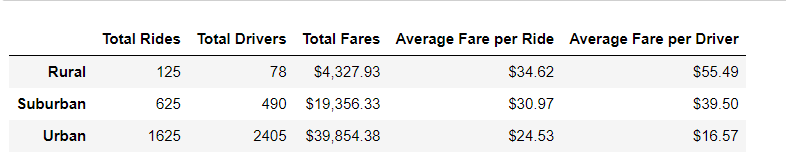
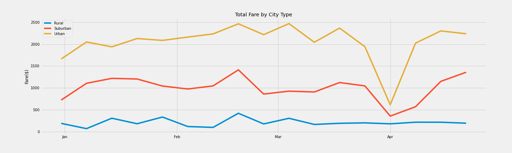

# PyBer_analysis
## Overview of the analysis: 
The purpose of this analysis is to summarize ride sharing data, specifically, the total amount of fare charged across different types of cities: Urban, Suburban, and Rural. Additional analysis on the amount of fare charged include how much was charged per ride and per number of drivers. This information will be used by the Pyber to make decisions in provide their services to underserved neighborhoods.
## Results
As presented in the summary dataframe table (figure.1), urban cities generated the highest amount of total fares, followed by suburban cities. Rural cities yielded the lowest amount of fares. This trend is better illustrated in figure.2 on a weekly basis over a 4 month period between January through April. While the beginning month of April showed a dip in total fares across all city types, urban cities still generated the highest amount, followed by suburban cities, and rural cities yielded the lowest amount of total fares.
While rural cities generated the lowest total amount of fares, it yielded the highest average fare per ride and per driver count, followed by suburban cities (figure.1). Urban cities yielded the lowest average fare. This is attributed to population density in urban areas as compared to less populated suburban and rural cities.

#### Figure.1 (summary dataframe table)

#### Figure.2 (Multi-line graph summarizing fare by city type)

## Summary:

1.	Increase the number of drivers in rural areas as a means to increase service to generate more fares and bring the average fare per driver to better equate to suburban and urban areas.
2.	Increase the number of driver availability in suburban areas as a means to increase service to generate more fares and this will bring the average fare per driver to better equate to urban areas.
3.	Increase the fare rate as appropriate to further generate more fares and increase the average fare per ride and driver since demand is high.
